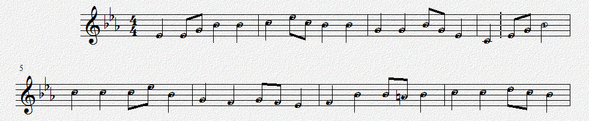

# 音频转乐谱

> 2016.5.27 信号与系统小论文，提纲；王旭康 2014011570

给出一段钢琴（或其他乐器）的**录音**，通过频域分析给出**乐谱**。

## 音高的测量

不同乐器的声音在时域上有不同的波形；在频域上看，就是声音的**高次谐波**有着不同特性。

对单个音符的音频进行傅里叶变换后，即可看到基波和众多高次谐波的关系：

钢琴单个音符(C4,262Hz)的频率谱：

钢琴的频谱上，可以清晰的看到15次谐波峰(15*262Hz=3.93kHz)；

竖笛单个音符(C4,262Hz)的频率谱：

而竖笛的频谱可以看到7次谐波峰(7*262Hz=1.83kHz)。

不同的谐波关系决定了不同的音色；而基波的频率决定了音符的音高。

另外从图中也可以看出，**高次谐波的强度**很有可能比**基波** 大，所以要根据高次谐波的频率，根据高次谐波同基波的**倍数关系**，给出正确的基波的频率，即音高。

## 节拍的测定 / 音符的划分

以上的分析只对**单个音符**有效；如果对**连续的两个音符** 做频域变换，就无法得到理想的结果。因此需要提出**音符分离**的方法。

由于整个乐曲的**音符分布有周期性**，所以可以先求整个乐曲**能量的时域分布**，然后提取乐曲能量波动的周期。典型乐曲大约是每分钟60拍到144拍，也就是1Hz到2.4Hz。这个方法要求乐曲的节拍和音符的分布非常稳定。

此外也可以考虑使用**针对能量的反卷积方法**。首先提取乐谱能量上的时域分布，然后使用单个音符的能量在时域上的分布进行反卷积，就可以获得脉冲序列，而这些脉冲序列所在的位置就是音符的位置。注意，这个方法要求每个音符的能量在时域上的分布都是相同的，因此只能识别一个乐器。

## 和声的处理 *（待定）*

和声是指**在同一时刻，不同音高的音符同时奏响**的情况。虽然这些音符的基波不同，但是他们的一些高次谐波却可能构成共振，因此特定音符所构成的和声悦耳动听。

和声的高次谐波非常复杂，只在低频段可以区分其低音部分的基波。因此在低频基波非常强的情况下，高音部分的频率很有可能被基波的高次谐波淹没，**造成和声的高音无法识别**。

## 运行结果与MATLAB源码 - 独奏，无和声

乐曲：

运行示例：

    D4# D4# D4# G4  A4# A4# A4# A4# C5  C5  D5# C5  A4# A4# A4# A4# 
    G4  G4  G4  G4  A4# G4  D4# D4# C4  C4  D4# G4  A4# A4# A4# A4# 
    C5  C5  C5  C5  C5  D5# A4# A4# G4  G4  F4  F4  G4  F4  D4# D4# 
    F4  F4  A4# A4# A4# A4  A4  A4# C5  C5  C5  C5  D5  C5  A4# A4# 
    A4# A4# ??? ??? D4# 
    1=D4#
    1	1	1	3	5	5	5	5	6	6	^1	6	5	5	5	5	
    3	3	3	3	5	3	1	1	_6	_6	1	3	5	5	5	5	
    6	6	6	6	6	^1	5	5	3	3	2	2	3	2	1	1	
    2	2	5	5	5	4	4	5	6	6	6	6	7	6	5	5	
    5	5	??	??	1	

MATLAB源码：

    % 将wav文件转化为音符
    % 王旭康，2016.5.27
    % 适用Matlab2014以上
    
    %将乐曲分帧，分别进行傅里叶变换
        %以取样频率 f0=44100Hz 计算
        %一帧包含16384个数据时，即持续0.372s；频率精度为2.69Hz
        %此文件进行的是但音符识别，取得最大幅度对应的频率，再向下查找2~4倍找到基频
    
    [SIGNAL,FREQ]=audioread('D:\MyMusic\Overture\school_song\school_song_single_Eb.wav');    %读入wav文件
    
    LEN=16384;     %傅里叶变换取样长度，即一帧包含的数据量
    MAXF=440;   %最高识别频率
    MINA=10;    %最低响度
    
    FREQ_LIST=linspace(0,FREQ/2,LEN/2);    %获得0到fs/2, 共l/2个数字的等差数列
    
    n=int32(length(SIGNAL)/LEN);        %总帧数
    
    notes_list = zeros(1, n);       
    freqs_list = zeros(1, n);
    maxA_list = zeros(1, n);          %最大响度
    
    MAX_FREQ=int32(LEN/FREQ*MAXF*2);     %最高识别频率对应的个数
    
    key=['G3 ';'G3#';'A3 ';'A3#';'B3 '];
    key=[key;'C4 ';'C4#';'D4 ';'D4#';'E4 ';'F4 ';'F4#';'G4 ';'G4#';'A4 ';'A4#';'B4 '];
    key=[key;'C5 ';'C5#';'D5 ';'D5#';'E5 ';'F5 ';'F5#';'G5 ';'G5#';'A5 ';'A5#';'B5 '];
    key=[key;'C6 ';'C6#';'D6 ';'D6#';'E6 ';'F6 ';'F6#';'G6 ';'G6#';'A6 ';'A6#';'B6 '];
    
    %分段进行傅里叶分析
    for i = 1:n, 
        lX = fft( SIGNAL( (i-1)*LEN+1 : i*LEN ) );  %截取长度为l的一段数据的快速傅里叶变换    
        lX_cut = lX(1:MAX_FREQ);                    %高频截止
        
        lA = sqrt(lX_cut.*conj(lX_cut));      %取模
        if lA > 0
            lA = 20*log10(lA);        %dB
        end
        
        maxA_list(i) = max(lA);        %最大响度
        max_index = find(lA==maxA_list(i), 1 );
        best_index = max_index;
        for mult=2:4,
            if (lA(int32(max_index/mult)) > maxA_list(i)*0.7) 
                best_index = int32(max_index/mult);
            end
        end
        freqs_list(i) = FREQ_LIST( best_index );    %最优响度对应的频率
        notes_list(i) = log(freqs_list(i)/220) / log(2) * 12 + 3;     %计算音高
        
        %mm(i,1)=freqs_list(i);
        %mm(i,2)=notes_list(i);
        %mm(i,3)=maxA_list(i);
        
        if maxA_list(i)<MINA || notes_list(i)<-12
            notes_list(i)=NaN;
        end
        
    end
    
    for i = 1:n,
        if maxA_list(i)<MINA || notes_list(i)<-12
            notes_list(i)=NaN;
        end
        %mm(i,2)=t(i);
        %mm(i,3)=maxY(i);
    end
    
    
    K=[0,0,0,0,0,0,0,0,0,0,0,0];  %定调
    
    %输出原乐谱
    for i=1:n,
        %try
            if notes_list(i)==notes_list(i) % not NaN
                p = round(notes_list(i));
                if p>0
                    for j = 1:3
                            fprintf('%c',key(p,j));
                    end
                else
                    fprintf('%d ',p);
                end
                fprintf(' ');
                
                K(mod(p-1,12)+1)=K(mod(p-1,12)+1)+1;
            else
                fprintf('??? ');
            end
        %catch
        %    fprintf('\nAn error catched!');
        %end
        if mod(i,16)==0 
            fprintf('\n'); 
        end
    end
    
    h7=[0,2,4,5,7,9,11];
    w7=[3,2,3,1,3,3,1];
    maxSc=0;  % 用于统计定调
    bestMc=6;
    for mc=6:17,
        sc=0;
        for i=1:length(h7)
            sc=sc+K(mod(mc+h7(i)-1,12)+1)*w7(i);
        end
        if maxSc<sc
            maxSc=sc;
            bestMc=mc;
        end
    end
    
    %输出修订乐谱
    
    fprintf('\n1=');
    for j=1:3
        fprintf('%c',key(bestMc,j));
    end
    fprintf('\n');
    
    for i=1:n,
        try
            if notes_list(i)==notes_list(i) 
                p=notes_list(i);            
                p=p-bestMc;
                
                while p<-0.5
                    fprintf('_');
                    p=p+12;
                end
                while p>=11.5
                    fprintf('^');
                    p=p-12;
                end            
                
                if p<1
                    fprintf('1');                
                elseif p<3
                    fprintf('2');
                elseif p<4.5
                    fprintf('3');
                elseif p<6
                    fprintf('4');
                elseif p<8
                    fprintf('5');
                elseif p<10
                    fprintf('6');
                else
                    fprintf('7');
                end
                
                fprintf('\t');
                
                K(mod(p-1,12)+1)=K(mod(p-1,12)+1)+1;
            else
                fprintf('??\t');
            end
        catch
        end
        if mod(i,16)==0 
            fprintf('\n'); 
        end
    end
    
    %for i=2:n-1,    
    %    if (maxY(i)<maxY(i+1) | maxY(i)<maxY(i-1)) & t(i-1)==t(i+1)
    %        t(i)=t(i+1);
    %    end      
    %end
    
    fprintf('\n');
    
    subplot(2,2,1)
    plot(notes_list)
    subplot(2,2,3)
    plot(SIGNAL)
    subplot(2,2,2)
    hist(notes_list)

