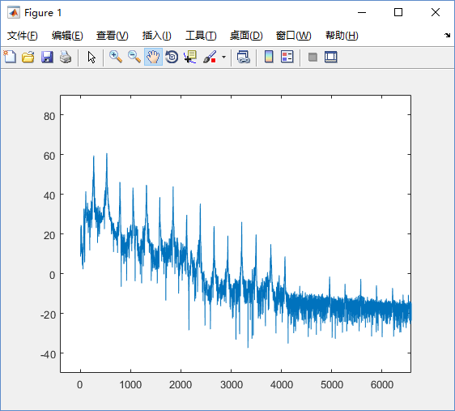
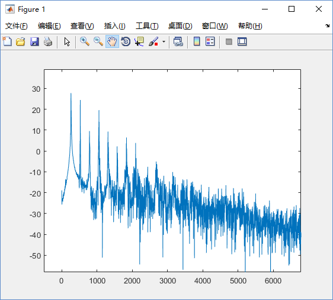
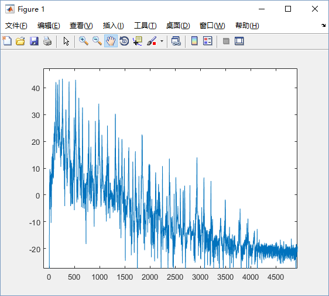
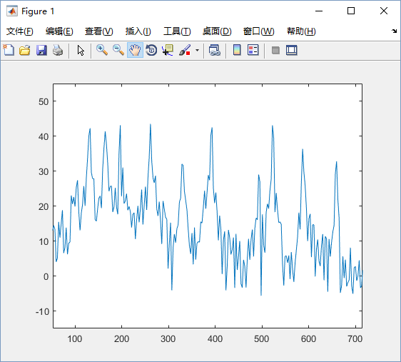

# 音频转乐谱

>  信号与系统小论文 2016.6.23
>  王旭康 2014011570 
>  张蔚桐 

给出一段钢琴（或其他乐器）的**录音**，通过频域分析给出**乐谱**。

## 音高

### 音频 

> 基波决定音高，谐波决定音色。

不同乐器发出同一个音高，声音是有区别的。在时域上看，乐器的声音有不同的波形。在频域上看，乐器声音的**高次谐波**有着不同特性。

实际上，**谐波关系**决定了乐器的音色； 而 **基波频率** 决定音符的音高。

对不同乐器的单个音符的音频进行傅里叶变换后，即可看到基波和众多高次谐波的关系：

- 钢琴单个音符(C4,262Hz)的频率谱：

> 图中纵坐标是已经取过对数的频率强度，横坐标是频率的值。高频部分的幅值都很低，已经舍弃。 钢琴的频谱上，可以清晰的看到15次谐波峰(15*262Hz=3.93kHz)；每个谐波峰所对应的频率都是基频的整数倍。

- 竖笛单个音符(C4,262Hz)的频率谱：

> 而竖笛的音色与钢琴有明显的不同：低频段（基波部分）更加光滑；谐波峰可以观察到7阶(7*262Hz=1.83kHz)。

从图中也可以看出，**高次谐波的强度**很有可能比**基波** 大，因此单纯通过频域强度判断基波位置是不可行的。 为了准确判断基波位置，我们要合理的利用谐波与基波之间的频率倍数关系。

### 乐谱

> 基波频率的取值是离散的。

为了乐器之间配合的需要，并不是所有基波频率都可能出现在乐曲中。

以标准中音A5为440Hz作为标准，每个八度音符之间的频率关系为2倍。而八度音符之间共有12个半音，每两个半音之间的频率倍数关系是相同的；因此每两个半音之间的频率都是 2 ^ (1/12) = 1.06 倍。

那么以普通人声歌唱的基频为例：普通男声的音域一般为小字一组c1到小字二组d2，也就是歌唱时基频的范围为262Hz~587Hz。

### 低音

> 鉴别低音的难点：被采样点个数限制的FFT最小分辨频率

为了区分乐谱中音符的最小相隔单位半音，我们考查c1和c1#，这2个音符的基频分别为262Hz和277Hz，间隔为15Hz。因此，如果要将普通男声识别为音符，并准确区分2个半音，频域变换的精度要达到7.5Hz以上，否则无法找到相邻的2个波峰。

钢琴的音域更加宽广，基频的范围是27Hz到4.186kHz。如果想要准确判断最低的两个音（27.500Hz和29.135Hz），频域变换的精度就要达到0.81Hz。这也意味着这些低音要延续较长的时间才可能被准确检测出来。

本次测试使用的音频采样频率为44.1kHz（CD常用采样频率，大约是20kHz的奈奎斯特频率），使用FFT的采样点个数为16384个，一组采样时长为16384/44.1kHz=0.37152s，因此相邻频率点间隔为2.69Hz，至少可以分辨相距5.38Hz以上的波峰。

而测试使用的音频中，已经限制了音符的范围，即只使用基频110Hz~880Hz段的音符；最难分辨的半音频率分别为110.00Hz和116.54Hz，相隔6.54Hz，刚好可以分辨。

### 高音

> 鉴别高音的难点：谐波分量干扰

当两个音符同时奏响的时候（乐理上称为和弦），低音的各个谐波分量会穿插在高音频段，很大程度上干扰了高音的鉴别。

- 2倍谐波：12 * log(2, 2) = 12；会在高八度的音符基频处产生谐波。
- 3倍谐波：12 * log(2, 3) = 19；会在高八度+纯五度的音符基频处产生谐波。

以上2个谐波的强度强，又发生在其他音符的基频上，因此会对高音的鉴别产生非常大的影响。

给出一个常见的和弦例子，乐曲中的基频分别为130.813Hz(c)，164.814Hz(e)，195.998Hz(g)，261.626Hz(c1)

这个波形相当于是4个等差数列的混合，看起来自然非常的混乱。

几个音符的关键谐波位置：

- c: 130.813, **261.626**, **392.439**, **523.252**, **654.065**
- e: 164.814, 329.628, 494.442, **659.256**
- g: 195.998, **391.996**, 587.994
- c1: **261.626**, **523.252**

对应的低频部分：

几个突出的峰分别为

- 131 (c基频)
- 165 (e基频)
- 196 (g基频)
- 262 (c二倍谐波+c1基频)
- 328 (e二倍谐波)
- 393 (c三倍谐波+g二倍谐波)
- 494 (e三倍谐波)
- 522 (c四倍谐波+c1二倍谐波)
- 587 (g三倍谐波)
- 659 (c五倍谐波+e四倍谐波)

和弦动听的关键就在于不同音符的高次谐波相互共振。不过这一点为和弦音符的分析带来了极大的困难。

## 节拍

> 保证一次FFT处理的数据里不会**先后**出现2个音符。

如果对**时间上相继出现的两个音符** 同时做频域变换，两个音符的频谱自然会出现重叠。因此**音符分离**也是很重要的。

由于整个乐曲的**音符分布有周期性**，所以可以先求整个乐曲**能量的时域分布**，然后提取乐曲能量波动的周期。典型乐曲大约是每分钟60拍到144拍，也就是1Hz到2.4Hz。这个方法要求乐曲的节拍和音符的分布非常稳定。

此外也可以考虑使用**针对能量的反卷积方法**。首先提取乐谱能量上的时域分布，然后使用单个音符的能量在时域上的分布进行反卷积，就可以获得脉冲序列，而这些脉冲序列所在的位置就是音符的位置。注意，这个方法要求每个音符的能量在时域上的分布都是相同的，因此只能识别一个乐器。

节拍上的测定难度较大，为了简化实现，我们已经将测试乐曲的频率调整到了合适的节拍。一分钟80.75个四分音符，就是说一个八分音符的持续时间为 60s / 80.75 / 2 = 0.3715s，刚好是FFT所截取的一帧的长度。

## 解决方案：钢琴单手独奏识别

> 最基本的实现；此方案已经完成。

所有处理在MATLAB中进行。MATLAB读入wav音频文件，将其分为多个固定长度(16394/44.1kHz=0.37s)的帧，然后分别进行FFT并进行频域上的分析。

由于一帧中只会出现一个音符，因此所有的波峰都是基波的倍数，所以检测到任何一个波峰，都可以快速找到基波的位置。

具体的，先找到频谱中幅度的最大值所在位置。**幅度最大的频率不一定是基频，但是一定是基频的倍数。**所以向下检查这个频率的“基波”是否存在，即此频率的1/2,1/3等处的幅度是否也较高。如果在向下查找中找到了更好的频率，则确认之为基频。

最后将每一帧的数据汇总起来，再进行一次修订。
最后可以打印出乐曲的简谱。

以下测试用歌曲为校歌。

### 运行结果与MATLAB源码 - 独奏，无和声

实际用乐谱：

运行示例：

    D4# D4# D4# G4  A4# A4# A4# A4# C5  C5  D5# C5  A4# A4# A4# A4# 
    G4  G4  G4  G4  A4# G4  D4# D4# C4  C4  D4# G4  A4# A4# A4# A4# 
    C5  C5  C5  C5  C5  D5# A4# A4# G4  G4  F4  F4  G4  F4  D4# D4# 
    F4  F4  A4# A4# A4# A4  A4  A4# C5  C5  C5  C5  D5  C5  A4# A4# 
    A4# A4# ??? ??? D4# 
    1=D4#
    1	1	1	3	5	5	5	5	6	6	^1	6	5	5	5	5	
    3	3	3	3	5	3	1	1	_6	_6	1	3	5	5	5	5	
    6	6	6	6	6	^1	5	5	3	3	2	2	3	2	1	1	
    2	2	5	5	5	4	4	5	6	6	6	6	7	6	5	5	
    5	5	??	??	1	

MATLAB源码：

    % 将wav文件转化为音符
    % 王旭康，2016.5.27
    % 适用Matlab2014以上
    
    %将乐曲分帧，分别进行傅里叶变换
        %以取样频率 f0=44100Hz 计算
        %一帧包含16384个数据时，即持续0.372s；频率精度为2.69Hz
        %此文件进行的是但音符识别，取得最大幅度对应的频率，再向下查找2~4倍找到基频
    
    [SIGNAL,FREQ]=audioread('D:\MyMusic\Overture\school_song\school_song_single_Eb.wav');    %读入wav文件
    
    LEN=16384;     %傅里叶变换取样长度，即一帧包含的数据量
    MAXF=440;   %最高识别频率
    MINA=10;    %最低响度
    
    FREQ_LIST=linspace(0,FREQ/2,LEN/2);    %获得0到fs/2, 共l/2个数字的等差数列
    
    n=int32(length(SIGNAL)/LEN);        %总帧数
    
    notes_list = zeros(1, n);       
    freqs_list = zeros(1, n);
    maxA_list = zeros(1, n);          %最大响度
    
    MAX_FREQ=int32(LEN/FREQ*MAXF*2);     %最高识别频率对应的个数
    
    key=['G3 ';'G3#';'A3 ';'A3#';'B3 '];
    key=[key;'C4 ';'C4#';'D4 ';'D4#';'E4 ';'F4 ';'F4#';'G4 ';'G4#';'A4 ';'A4#';'B4 '];
    key=[key;'C5 ';'C5#';'D5 ';'D5#';'E5 ';'F5 ';'F5#';'G5 ';'G5#';'A5 ';'A5#';'B5 '];
    key=[key;'C6 ';'C6#';'D6 ';'D6#';'E6 ';'F6 ';'F6#';'G6 ';'G6#';'A6 ';'A6#';'B6 '];
    
    %分段进行傅里叶分析
    for i = 1:n, 
        lX = fft( SIGNAL( (i-1)*LEN+1 : i*LEN ) );  %截取长度为l的一段数据的快速傅里叶变换    
        lX_cut = lX(1:MAX_FREQ);                    %高频截止
        
        lA = sqrt(lX_cut.*conj(lX_cut));      %取模
        if lA > 0
            lA = 20*log10(lA);        %dB
        end
        
        maxA_list(i) = max(lA);        %最大响度
        max_index = find(lA==maxA_list(i), 1 );
        best_index = max_index;
        for mult=2:4,
            if (lA(int32(max_index/mult)) > maxA_list(i)*0.7) 
                best_index = int32(max_index/mult);
            end
        end
        freqs_list(i) = FREQ_LIST( best_index );    %最优响度对应的频率
        notes_list(i) = log(freqs_list(i)/220) / log(2) * 12 + 3;     %计算音高
        
        %mm(i,1)=freqs_list(i);
        %mm(i,2)=notes_list(i);
        %mm(i,3)=maxA_list(i);
        
        if maxA_list(i)<MINA || notes_list(i)<-12
            notes_list(i)=NaN;
        end
        
    end
    
    for i = 1:n,
        if maxA_list(i)<MINA || notes_list(i)<-12
            notes_list(i)=NaN;
        end
        %mm(i,2)=t(i);
        %mm(i,3)=maxY(i);
    end
    
    
    K=[0,0,0,0,0,0,0,0,0,0,0,0];  %定调
    
    %输出原乐谱
    for i=1:n,
        %try
            if notes_list(i)==notes_list(i) % not NaN
                p = round(notes_list(i));
                if p>0
                    for j = 1:3
                            fprintf('%c',key(p,j));
                    end
                else
                    fprintf('%d ',p);
                end
                fprintf(' ');
                
                K(mod(p-1,12)+1)=K(mod(p-1,12)+1)+1;
            else
                fprintf('??? ');
            end
        %catch
        %    fprintf('\nAn error catched!');
        %end
        if mod(i,16)==0 
            fprintf('\n'); 
        end
    end
    
    h7=[0,2,4,5,7,9,11];
    w7=[3,2,3,1,3,3,1];
    maxSc=0;  % 用于统计定调
    bestMc=6;
    for mc=6:17,
        sc=0;
        for i=1:length(h7)
            sc=sc+K(mod(mc+h7(i)-1,12)+1)*w7(i);
        end
        if maxSc<sc
            maxSc=sc;
            bestMc=mc;
        end
    end
    
    %输出修订乐谱
    
    fprintf('\n1=');
    for j=1:3
        fprintf('%c',key(bestMc,j));
    end
    fprintf('\n');
    
    for i=1:n,
        try
            if notes_list(i)==notes_list(i) 
                p=notes_list(i);            
                p=p-bestMc;
                
                while p<-0.5
                    fprintf('_');
                    p=p+12;
                end
                while p>=11.5
                    fprintf('^');
                    p=p-12;
                end            
                
                if p<1
                    fprintf('1');                
                elseif p<3
                    fprintf('2');
                elseif p<4.5
                    fprintf('3');
                elseif p<6
                    fprintf('4');
                elseif p<8
                    fprintf('5');
                elseif p<10
                    fprintf('6');
                else
                    fprintf('7');
                end
                
                fprintf('\t');
                
                K(mod(p-1,12)+1)=K(mod(p-1,12)+1)+1;
            else
                fprintf('??\t');
            end
        catch
        end
        if mod(i,16)==0 
            fprintf('\n'); 
        end
    end
    
    %for i=2:n-1,    
    %    if (maxY(i)<maxY(i+1) | maxY(i)<maxY(i-1)) & t(i-1)==t(i+1)
    %        t(i)=t(i+1);
    %    end      
    %end
    
    fprintf('\n');
    
    subplot(2,2,1)
    plot(notes_list)
    subplot(2,2,3)
    plot(SIGNAL)
    subplot(2,2,2)
    hist(notes_list)

